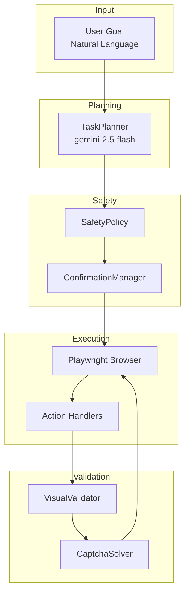

# 🤖 Browser Automation System - Documentation

> **Gemini-Powered AI Browser Automation with Safety Guardrails**

---

## 📋 Table of Contents

1. [Overview](#overview)
2. [Architecture](#architecture)
3. [Installation](#installation)
4. [Quick Start](#quick-start)
5. [Modules Reference](#modules-reference)
6. [Configuration](#configuration)
7. [Safety & Security](#safety--security)
8. [API Reference](#api-reference)

---

## Overview

A powerful browser automation system powered by **Google Gemini AI** (`gemini-2.5-computer-use-preview-10-2025`). The system converts natural language tasks into automated browser actions with built-in safety checks, visual validation, and CAPTCHA handling.

### ✨ Key Features

| Feature | Description |
|---------|-------------|
| 🧠 **AI-Powered** | Uses Gemini's Computer Use API for intelligent browser control |
| 🛡️ **Safety First** | Blocks dangerous domains, payment actions, and destructive operations |
| 👁️ **Visual Validation** | AI validates each step using screenshots |
| 🔐 **CAPTCHA Handling** | Detects and attempts to solve CAPTCHAs |
| ✅ **User Confirmation** | Shows plan preview and requires approval |
| 🚨 **Emergency Stop** | Press `Ctrl+C` anytime to halt execution |

---

## Architecture



### 📁 Project Structure

```
browser-automation/
├── main.py              # Entry point & orchestration
├── config.py            # Configuration & API setup
├── utils.py             # Core helpers (compatibility layer)
├── requirements.txt     # Python dependencies
├── .env                 # API keys (not in repo)
├── error_screenshots/   # Failed step screenshots
└── utils/               # Core modules
    ├── __init__.py      # Package exports & singletons
    ├── actions.py       # Browser action execution
    ├── task_planner.py  # NL → execution plan
    ├── visual_validator.py  # Screenshot validation
    ├── confirmation.py  # User approval workflow
    ├── safety_policy.py # Security enforcement
    ├── captcha_solver.py    # CAPTCHA handling
    └── helpers.py       # Coordinate & display utils
```

---

## Installation

### Prerequisites

- Python 3.9+
- Google Gemini API key

### Steps

```bash
# 1. Clone the repository
git clone <repo-url>
cd browser-automation

# 2. Create virtual environment
python -m venv venv
venv\Scripts\activate  # Windows
# source venv/bin/activate  # Linux/Mac

# 3. Install dependencies
pip install -r requirements.txt

# 4. Install Playwright browsers
playwright install chromium

# 5. Create .env file
echo GEMINI_API_KEY=your_api_key_here > .env
```

### Dependencies

| Package | Version | Purpose |
|---------|---------|---------|
| `google-genai` | ≥1.0.0 | Gemini AI SDK |
| `playwright` | ≥1.40.0 | Browser automation |
| `python-dotenv` | ≥1.0.0 | Environment management |
| `colorama` | ≥0.4.6 | Terminal colors |
| `tenacity` | ≥8.0.0 | API retry logic |

---

## Quick Start

### Basic Usage

```bash
python main.py "Go to YouTube and search for Python tutorials"
```

### Example Tasks

```bash
# Web Search
python main.py "Go to Google and search for weather in Delhi"

# Video Search
python main.py "Open YouTube and search for relaxing music"

# Wikipedia
python main.py "Go to Wikipedia and search for Artificial Intelligence"
```

### Execution Flow

1. **Plan Generation** → AI creates step-by-step plan
2. **User Confirmation** → Review and approve (Y/S/N)
3. **Browser Launch** → Chromium opens with viewport
4. **Step Execution** → AI executes each step
5. **Visual Validation** → Screenshot validates success
6. **Summary** → Shows completed/failed steps

---

## Modules Reference

### 1. 📋 TaskPlanner (`utils/task_planner.py`)

Converts natural language goals into structured execution plans.

```python
from utils import generate_plan

plan = generate_plan("Search for laptops on Amazon")
# Returns TaskPlan with Step objects
```

#### Data Classes

| Class | Description |
|-------|-------------|
| `Step` | Single action step (action, description, target, value, expected) |
| `TaskPlan` | Complete plan with goal, steps list, and success criteria |

#### Step Actions

| Action | Description |
|--------|-------------|
| `navigate` | Go to a URL |
| `click` | Click an element |
| `type` | Type text into input |
| `scroll` | Scroll the page |
| `wait` | Wait for duration |
| `search` | Type and press Enter |

---

### 2. ⚡ Actions (`utils/actions.py`)

Executes browser actions via Playwright with safety checks.

#### Supported Functions

| Function | Description | Args |
|----------|-------------|------|
| `open_web_browser` | Opens Google homepage | - |
| `navigate` / `go_to_url` | Navigate to URL | `url` |
| `click_at` | Click at coordinates | `x`, `y` |
| `double_click_at` | Double click | `x`, `y` |
| `right_click_at` | Right click | `x`, `y` |
| `hover_at` | Hover mouse | `x`, `y` |
| `type_text` | Type text | `text` |
| `type_text_at` | Click + type | `x`, `y`, `text`, `press_enter` |
| `press_key` | Press keyboard key | `key` |
| `scroll` | Scroll at position | `x`, `y`, `delta_x`, `delta_y` |
| `scroll_up` / `scroll_down` | Quick scroll | `amount` |
| `go_back` / `go_forward` | Browser history | - |
| `refresh` | Reload page | - |
| `wait` | Sleep duration | `duration` |
| `solve_captcha` | Attempt CAPTCHA | - |

#### Coordinate System

Gemini returns normalized coordinates (0-1000). The system converts them:

```python
# Normalized → Pixel
actual_x = normalized_x * SCREEN_WIDTH / 1000
actual_y = normalized_y * SCREEN_HEIGHT / 1000
```

---

### 3. 🛡️ SafetyPolicy (`utils/safety_policy.py`)

Enforces security rules to prevent dangerous actions.

```python
from utils import SafetyPolicy, SessionScope

scope = SessionScope(
    allowed_domains=["youtube.com", "google.com"],
    max_actions=100,
    max_tokens=200000,
    timeout_minutes=30,
)
policy = SafetyPolicy(scope)
```

#### Blocked Domains

| Category | Examples |
|----------|----------|
| 💳 Payment | paypal.com, stripe.com, razorpay.com |
| 🏦 Banking | *bank*, icicibank.com, chase.com |
| 💰 Crypto | binance.com, coinbase.com |
| ⚠️ Sensitive | account.google.com/delete |

#### Blocked Keywords

| Category | Keywords |
|----------|----------|
| 💳 Payment | "pay now", "checkout", "buy now", "credit card", "cvv" |
| 🗑️ Destructive | "delete account", "factory reset", "format drive" |
| 🔐 Sensitive | "enter password", "enter otp", "social security" |
| 💰 Financial | "transfer money", "withdraw", "bitcoin" |

#### Session Limits

| Limit | Default | Description |
|-------|---------|-------------|
| `max_actions` | 100 | Maximum browser actions |
| `max_tokens` | 200,000 | Maximum API tokens |
| `timeout_minutes` | 30 | Session timeout |

---

### 4. 👁️ VisualValidator (`utils/visual_validator.py`)

Uses Gemini Vision to validate step success via screenshots.

```python
from utils import validate_step

result = validate_step(screenshot_bytes, "YouTube homepage loaded")
# Returns ValidationResult(success, reason, confidence, error_type)
```

#### Detection Capabilities

| Type | Description |
|------|-------------|
| ✅ Success | Expected state visible |
| ❌ Error Page | 404, 500, connection errors |
| 🔐 CAPTCHA | reCAPTCHA, image puzzles |
| 🚫 Blocked | "Access denied", rate limiting |

#### Error Screenshots

Failed steps automatically save screenshots to `error_screenshots/`:
- `error_2026-02-05_16-30-17_step3.png`
- `error_2026-02-05_16-30-17_step3.json` (metadata)

---

### 5. 🔐 CaptchaSolver (`utils/captcha_solver.py`)

AI-powered CAPTCHA detection and solving.

```python
from utils import detect_captcha_type, solve_page_captcha

# Detect CAPTCHA type
captcha_type = detect_captcha_type(page)  # 'recaptcha' | 'slider' | 'image' | None

# Attempt to solve
solved = solve_page_captcha(page)
```

#### Supported CAPTCHAs

| Type | Support Level |
|------|---------------|
| reCAPTCHA Checkbox | ✅ Attempts to click |
| reCAPTCHA Image | ⚠️ Basic analysis |
| Slider Puzzles | ✅ Human-like sliding |
| Image Text | ⚠️ OCR attempt |
| hCaptcha | 🚧 Detection only |

---

### 6. ✅ ConfirmationManager (`utils/confirmation.py`)

Handles user approval workflow with colored terminal output.

```python
from utils import confirm_plan, confirm_step

# Full plan approval
approval = confirm_plan(plan)  # 'yes' | 'step' | 'no'

# Step-by-step confirmation
proceed = confirm_step(step)  # True | False
```

#### Approval Options

| Option | Keyboard | Result |
|--------|----------|--------|
| Full Run | `Y` / `YES` | Execute all steps |
| Step-by-Step | `S` / `STEP` | Confirm each step |
| Cancel | `N` / `NO` | Abort execution |

---

## Configuration

### Environment Variables

| Variable | Required | Default | Description |
|----------|----------|---------|-------------|
| `GEMINI_API_KEY` | ✅ Yes | - | Google Gemini API key |
| `SCREEN_WIDTH` | No | 1440 | Browser viewport width |
| `SCREEN_HEIGHT` | No | 900 | Browser viewport height |

### `.env` Example

```env
GEMINI_API_KEY=your_gemini_api_key_here
SCREEN_WIDTH=1920
SCREEN_HEIGHT=1080
```

### Model Configuration

| Setting | Value |
|---------|-------|
| Model (Execution) | `gemini-2.5-computer-use-preview-10-2025` |
| Model (Planning & Validation) | `gemini-2.5-flash` |
| Max Iterations per Step | 5 |
| ThinkingConfig | Enabled |

---

## Safety & Security

### 🚨 Emergency Stop

Press **`Ctrl+C`** at any time to immediately halt execution.

```python
# In code
from utils import trigger_emergency_stop
trigger_emergency_stop()  # Halts all operations
```

### Violation Logging

All blocked actions are logged to `utils/safety_log.json`:

```json
{
  "violations": [
    {
      "timestamp": "2026-02-05T16:30:00",
      "violation_type": "blocked_domain",
      "action": "navigate to paypal.com",
      "url": "https://paypal.com",
      "details": "Domain matches blocked pattern: paypal.com",
      "blocked": true
    }
  ]
}
```

---

## API Reference

### Main Entry Point

```python
from main import run

run(
    goal="Your task description",
    confirm=True,           # Require user confirmation
    scope=SessionScope(...) # Custom session limits
)
```

### Utility Functions

```python
from utils import (
    # Planning
    generate_plan,          # goal → TaskPlan
    
    # Execution
    execute_function_calls, # Run model's function calls
    execute_action,         # Run single action
    
    # Validation
    validate_step,          # screenshot → ValidationResult
    save_error,             # Save error screenshot
    
    # Confirmation
    confirm_plan,           # Show plan, get approval
    confirm_step,           # Confirm single step
    
    # Safety
    SafetyPolicy,           # Main safety class
    SessionScope,           # Session limits config
    is_stopped,             # Check emergency stop
    reset_stop,             # Reset emergency stop
    
    # CAPTCHA
    detect_captcha_type,    # Detect CAPTCHA
    solve_page_captcha,     # Attempt solve
)
```

---

## 📞 Quick Reference

### Command Line

```bash
python main.py "Your task here"
```

### Workflow Shortcuts

| Key | Action |
|-----|--------|
| `Y` | Approve and run all |
| `S` | Step-by-step mode |
| `N` | Cancel execution |
| `Ctrl+C` | Emergency stop |

### Status Emojis

| Emoji | Meaning |
|-------|---------|
| 🚀 | System started |
| 📋 | Planning |
| 🛡️ | Safety check |
| 🌐 | Browser action |
| ✅ | Step completed |
| ❌ | Step failed |
| 🔐 | CAPTCHA detected |
| 🛑 | Blocked/Stopped |
| 📊 | Token usage |

---

> **Note:** This system is designed for legitimate automation tasks. Respect website terms of service and use responsibly.
